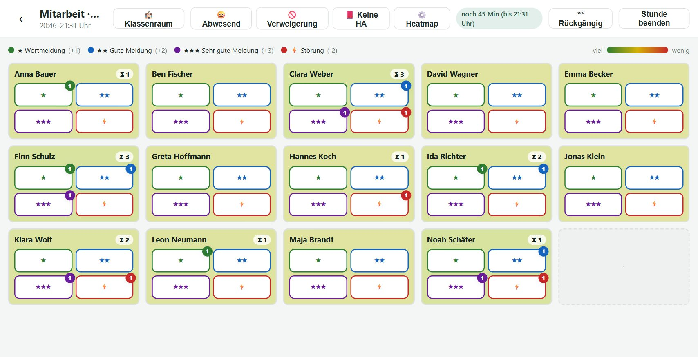
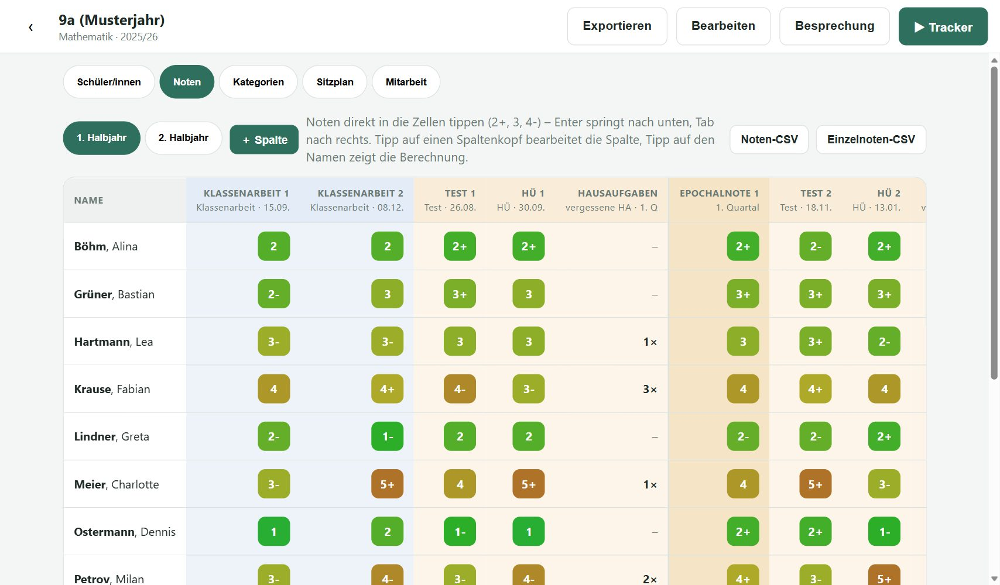
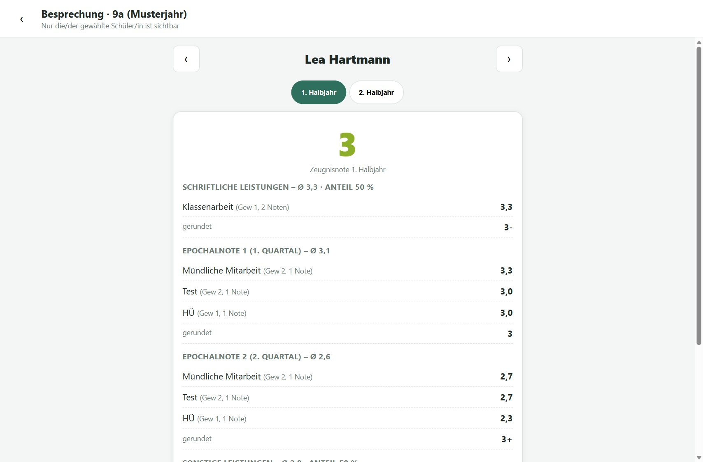

# Noten-Fritze

**Noten und mündliche Mitarbeit erfassen – direkt im Unterricht, auf dem iPad.**
Kostenlos, ohne Konto, ohne Cloud: Alle Daten bleiben auf deinem Gerät.

### ▶︎ [App starten](https://noten-fritze.patrick-knapp.de/) · 📖 [Anleitung & Funktionen](https://noten-fritze.patrick-knapp.de/info.html)



| Notenübersicht je Halbjahr | Besprechungsmodus |
|---|---|
|  |  |

- **Mitarbeits-Tracker** im Sitzplan: Meldungen (★ / ★★ / ★★★) und Störungen (⚡) per Tipp, Heatmap, Rückgängig
- **Notenübersicht** mit Epochal-, Zeugnis- und Jahresnote, Tendenznoten (2+, 3, 4-), ab Stufe 11 MSS-Punkte
- **Mehrere Sitzpläne** je Klasse (für verschiedene Räume)
- **Besprechungsmodus** für Notengespräche – nur eine Person sichtbar, mit Herleitung
- **Offline nutzbar** als App auf dem Home-Bildschirm, **Backup** als Datei

*Alle Namen in den Bildern sind erfundene Beispieldaten.*
Fragen, Fehler, Wünsche: [noten-fritze@patrick-knapp.de](mailto:noten-fritze@patrick-knapp.de) oder
[GitHub-Issues](https://github.com/PaK-X-NRW/Noten_Fritze/issues). Lizenz: [MIT](LICENSE).

---

# Für Entwickler/innen

Lokale Noten- und Mitarbeitsverwaltung für Lehrkräfte an Gymnasien.
**100 % lokal** im Browser (IndexedDB), **keine Cloud, kein Server, kein Login.**
Tablet-first, optimiert für das **iPad im Querformat**, offline nutzbar als PWA.

## Verfügbarkeit & Hosting

- **https://noten-fritze.patrick-knapp.de** (eigene Domain, zeigt auf GitHub Pages)
- Gehostet auf GitHub Pages: https://pak-x-nrw.github.io/Noten_Fritze/
- **Infoseite für Lehrkräfte** `info.html` (Funktionen, Anleitung, Datenschutzerklärung,
  Kontakt, Lizenz) – verlinkt auf der App-Startseite und unter Einstellungen →
  „Hilfe & Rechtliches“. Für Suchmaschinen: `robots.txt`, `sitemap.xml`,
  Seitenbeschreibung/Vorschau-Tags und strukturierte Daten (JSON-LD) in `info.html`.
- Lizenz: MIT (siehe `LICENSE`).

Jeder Stand, der auf `main` landet, geht automatisch online – erledigt vom Workflow
`.github/workflows/pages.yml`, der die Dateien unverändert hochlädt (kein Build, kein Jekyll).

---

## 1. Architektur & Begründung

**Vanilla JS + IndexedDB, ohne Build-Schritt, ohne Abhängigkeiten.**

- **Warum kein Framework?** Die App ist im Kern eine formular- und tabellenlastige
  Datenverwaltung mit klar abgegrenzten Screens. Das lässt sich mit einer schlanken,
  zustandsgesteuerten Render-Schleife (~1 Datei) robust abbilden. Kein Framework
  bedeutet: keine Toolchain, keine Versions-Updates, **läuft in 10 Jahren noch**,
  öffnet sich per Doppelklick. Genau das passt zur Anforderung „einfache, langlebige
  Technologie“.
- **Klassische `<script>`-Tags statt ES-Module**, damit die App auch direkt per
  `file://` (Doppelklick auf `index.html`) läuft – ES-Module würden dort an CORS
  scheitern. Modularität entsteht über getrennte Dateien und Namespaces
  (`DB`, `Store`, `Calc`, `CSV`, `UI`, `Views`).
- **Datenhaltung:** IndexedDB für alle Nutzdaten (asynchron, große Mengen,
  strukturierte Objekte). LocalStorage wird bewusst **nicht** für Nutzdaten benutzt.
- **Schichten:**
  - `version.js` – App-Version (`MAJOR.MINOR.PATCH`, eine Stelle für alles)
  - `db.js` – generischer IndexedDB-Wrapper (Promises, Schema-Versionierung)
  - `store.js` – Domänenmodell und Repositories (Kern des Namespace `Store`)
  - `store.einstellungen.js` – Standardwerte und App-Einstellungen
  - `store.stundenplan.js` – Stundenplan (Versionen), Wochennotizen, Termine/Kalender, Planungen
  - `store.migrationen.js` – Daten-Migrationen (`schemaVersion`)
  - `store.transfer.js` – Backup und Klassen-Export/-Import
  - `store.demo.js` – Demo-Daten beim ersten Start
  - `calc.js` – Rechen-Kern: Notenskala, Drittel-/Zeugnisskala, MSS (Namespace `Calc`)
  - `calc.zeugnis.js` – Halbjahres-Kette bis zur Zeugnisnote
  - `calc.mitarbeit.js` – Mitarbeits-Auswertung (Stundennoten-Modell)
  - `calc.tracker.js` – Heatmap, Stundenzeiten, vergessene Stunden
  - `calc.sitzplan.js` – Raumform-Vorlagen, Sitzregeln, automatisches Verteilen
  - `calc.stundenplan.js` – Wochen, A/B-Wochen, Versionen, tatsächlicher Tag, Monat, Klassenfarben
  - `calc.planung.js` – Stundenplanung: Einheit (Doppelstunde), Fahrplan aufteilen, Minuten, vorige Stunde, Umzug
    (alle `calc*.js` rein, ohne DOM/DB; geprüft in `tests.html`)
  - `csv.js` – CSV-Export/Import
  - `ui.js` – UI-Bausteine (Modal, Toast, Formfelder)
  - `views.core.js` – Views-Kern (State, Routing, Render-Schleife)
  - `views.einstellungen.js` – Einstellungen inkl. Stundenzeiten
  - `views.besprechung.js` – Besprechungsmodus
  - `views.home-klasse.js` – Home + Klassenansicht (Reiter Schüler, Kategorien)
  - `views.noten.js` / `views.noten.eingabe.js` – Reiter Noten (Tabelle, Dialoge / Eingabe, Nummernpad)
  - `views.sitzplan.js` – Reiter Sitzplan
  - `views.mitarbeit.js` – Reiter Mitarbeit inkl. Quartalsabschluss
  - `views.tracker.js` – Mitarbeits-Tracker
  - `views.stundenplan.js` – Stundenplan auf der Startseite (Wochenansicht)
  - `views.kalender.js` – Monatsansicht, Termine, Ausfall/Verschieben/Hinweis
  - `views.planung.js` – Stundenplanung (Fahrplan aus Bausteinen)
  - `views.dialoge.js` – allgemeine Dialoge
  - `views.js` – Aktions-Dispatcher (Action-Map, Delegation)
  - `app.js` – Bootstrap
- **PWA:** `manifest.webmanifest` + `service-worker.js` (App-Shell-Cache) für
  Offline-Betrieb und „Zum Home-Bildschirm hinzufügen“. Der Service Worker aktiviert
  sich nur beim Hosting über http(s), nicht unter `file://`.

## 2. Tech-Stack

| Bereich        | Wahl                     | Begründung |
|----------------|--------------------------|------------|
| Sprache        | HTML/CSS/Vanilla JS      | langlebig, keine Toolchain |
| Speicher       | IndexedDB                | lokal, asynchron, strukturiert |
| UI-Einstellung | (LocalStorage frei)      | nur für Kleinkram vorgesehen |
| Offline        | Service Worker + Manifest| PWA-Grundlagen ohne Ballast |
| Build          | **keiner**               | statische Dateien, sofort lauffähig |

## 3. Datenmodell (IndexedDB-Stores)

```
klassen        { id, name, schuljahr, fach, typ('hauptfach'|'nebenfach'),
                 klassenstufe(5..13, null=Sek.I), anteilSchriftlich, anteilSonstige,
                 mitarbeitSchwellen(null=global), farbe(Stundenplan/Kalender, null=berechnet),
                 abgeschlosseneQuartale[{quartal(1..4), datum}],
                 notizen, createdAt, updatedAt, lastOpenedAt }
schueler       { id, klasseId, vorname, nachname, bemerkung, sortIndex, ... }
                 (sortIndex = manuelle Reihenfolge; angezeigt wird je nach
                  settings.schuelerSortierung alphabetisch oder manuell)
kategorien     { id, klasseId, name, art('schriftlich'|'sonstige'),
                 gewichtung, anzeige('note'|'fehlendeHA'),
                 quelle('manuell'|'mitarbeit'), sortIndex }
                 (quelle 'mitarbeit' = wird über „Quartal abschließen“ gefüllt)
leistungen     { id, klasseId, kategorieId, quartal(1..4), titel, datum(YYYY-MM-DD),
                 sortIndex, createdAt }
                 (= eine Spalte der Notenübersicht, z. B. „2. Klassenarbeit“;
                  je Schüler/in steht darin genau eine Note)
noten          { id, klasseId, schuelerId, kategorieId, leistungId, wert(1..6,
                 oder 0..15 MSS-Punkte bei Klassenstufe >= 11, s. Calc.istMSS),
                 titel, datum(YYYY-MM-DD), quartal(1..4), halbjahr(1|2, abgeleitet),
                 createdAt }
                 (titel/datum/quartal folgen immer der Leistung)
sitzplaene     { klasseId, aktivId, plaene:[{ id, name, rows, cols,
                 seats:[{id,row,col,schuelerId,keinPlatz?}] }], regeln:[…] }
                 (ein Plan je Raum; aktivId = zuletzt benutzter Plan;
                 keinPlatz = Gang; regeln = Sitzregeln der Klasse, siehe unten)
ereignisse     { id, klasseId, schuelerId, stundeId, typ, punkte, timestamp,
                 quartal(1..4), halbjahr(1|2, abgeleitet), notiz }
stunden        { id, klasseId, datum(YYYY-MM-DD), startTs, endeTs, dauerMin, stundeNr,
                 quelle('plan'|'fallback'|'manuell'|'migriert'), quartal(1..4),
                 halbjahr(1|2, abgeleitet),
                 status('offen'|'beendet'), beendetAt, sitzplanId (Raum der Stunde),
                 createdAt, updatedAt }
                 (Ereignisse, die in einer vergessenen Stunde nachgetragen werden,
                 tragen als timestamp die Zeit der Stunde und in erfasstAm den
                 echten Zeitpunkt)
abwesenheiten  { id(schuelerId_datum), klasseId, schuelerId, datum(YYYY-MM-DD), createdAt }
stundenplaene  { id, gueltigAb(YYYY-MM-DD, Montag | null = von Anfang an),
                 eintraege:[{ id, tag(1..5 = Mo..Fr), blockId('std-3' | ID einer Pause),
                              woche('alle'|'A'|'B'), klasseId | null, titel (Freitext),
                              sitzplanId | null }], createdAt, updatedAt }
                 (je Datensatz eine Version des Wochenplans; gültig ist die mit dem
                 spätesten gueltigAb ≤ Datum, ältere als die heutige = Archiv)
wochennotizen  { montag(YYYY-MM-DD), text, updatedAt }   (Notiz je Woche)
termine        { id, art('klassenarbeit'|'test'|'konferenz'|'elternabend'|'aufsicht'|
                 'vertretung'|'sonstiges'|'ferien'|'aenderung'), titel, datum, bis (Ferien),
                 blockId | null (ganztägig), klasseId | null, notiz,
                 aenderung('ausfall'|'verschoben'|'hinweis'), nachDatum, nachBlockId,
                 verschiebeModus('einheit'|'stunde'|null = Planungen beim Ausfall weitergeschoben),
                 createdAt, updatedAt }
                 (Änderungen meinen eine Stunde über Datum + Block + Klasse bzw. Freitext;
                 der Plan selbst bleibt unverändert)
planungen      { id, klasseId, datum, blockId, thema, bausteine:[{ id, typ('text'|'link'|'datei'),
                 phase, minuten, text, url, dateiId }], createdAt, updatedAt }
                 (je Stunde ein Datensatz; eine Doppelstunde = zwei Datensätze, im Fenster
                 ein Fahrplan mit Trennlinie; zieht beim Verschieben der Stunde mit)
dateien        { id, name, mime, groesse, daten(ArrayBuffer | null), behalten, entferntAm, erstelltAm }
                 (Kopie einer angehängten Datei; den Inhalt entfernt der App-Start nach der Frist,
                 Name/Größe bleiben – auch im Baustein; im Backup nur auf Wunsch, als Base64)
einstellungen  { key:'app', schemaVersion, aktuellesQuartal(1..4), haModus('punkte'|'note6'),
                 stundenzeiten [{ id, art('stunde'|'pause'), name, start, ende, nr }]
                 (bis 1.15: stundenplan, wird beim Lesen umgewandelt),
                 schuelerSortierung('nachname'|'manuell'),
                 startAnsicht('klassen'|'stundenplan'),
                 abWochen [{ abMontag, woche('A'|'B') }] (Umschaltpunkte der A/B-Wochen),
                 sitzplanKachelSpalten(6..15, Standard 9),
                 mitarbeitPunkte, mitarbeitSchwellen,
                 heatPunkteEinfach, heatPunkteGut, heatPunkteSehrGut,
                 heatStartWert, heatVerfallPunkte, heatVerfallMinuten, anteile,
                 dateiAufbewahrung('frist'|'nie'), dateiFristTage(Standard 14) }
                 (key:'export' = Handle des Export-Ordners, File System Access API)
```

- **Integrität:** Löschen einer Klasse/eines Schülers löscht kaskadierend alle
  abhängigen Datensätze (Leistungen, Noten, Ereignisse, Stunden, Abwesenheiten,
  Sitzplatz-Zuweisung, Einträge im Stundenplan, Termine, Planungen); das Löschen einer Kategorie oder einer Spalte nimmt die
  darin erfassten Noten mit.
- **App-Version:** `APP_VERSION` in `js/version.js` (Schema `MAJOR.MINOR.PATCH`,
  aktuell **1.15.0**) ist die sichtbare Programmversion: angezeigt unter
  Einstellungen → Über, Name des Service-Worker-Caches, Feld `appVersion` im
  JSON-Backup. Sie wird von Hand gepflegt und ist unabhängig von den beiden
  internen Zählern unten.
- **Versionierbarkeit der Daten (zweistufig):** `DB_VERSION` + `onupgradeneeded` in `db.js`
  versioniert die **Struktur** (Stores/Indizes, additiv). Zusätzlich versioniert
  `schemaVersion` im einstellungen-Store die **Datenform**: eine kaskadierte
  Migrations-Pipeline in `store.migrationen.js` (`MIGRATION_STEPS`, Schlüssel = Ziel-Version)
  transformiert Datensätze beim App-Start Schritt für Schritt (v1→v2→v3 …).
  Neue Felder bekommen immer Defaults, damit alte Datensätze nicht crashen.
  Zusätzlich JSON-Voll-Backup als Sicherung.

## 4. Rechenlogik – von der Einzelnote zur Zeugnisnote

Die Notenübersicht zeigt immer **ein Halbjahr**; die beiden Quartale darin
stecken als Epochalnoten in der Tabelle. Die Kette (`Calc.halbjahrErgebnis`):

1. **Spalte (Leistung):** genau eine Note je Schüler/in, z. B. „2. Klassenarbeit“.
   Ihre Kategorie liefert das Gewicht, ihr Quartal die Zuordnung.
2. **Epochalnote je Quartal:** gewichteter Ø aller sonstigen Kategorien des
   Quartals, gerundet auf **Drittel** (x,0 · x,3 · x,7). Sie entsteht erst, wenn
   die **Mitarbeitsnote** des Quartals vorliegt – vorher steht dort „⋯“ (siehe
   „Mitarbeit in der Notenübersicht“ unten).
3. **Sonstige Leistungen (Halbjahr):** Ø der beiden – bereits gerundeten –
   Epochalnoten, wieder auf Drittel gerundet. Fehlt ein Quartal, zählt das
   vorhandene zu 100 %.
4. **Schriftliche Leistungen (Halbjahr):** gewichteter Ø aller schriftlichen
   Kategorien über das ganze Halbjahr, auf Drittel gerundet.
5. **Zeugnisnote:** `anteilSchriftlich %` · schriftlich + `anteilSonstige %` ·
   sonstige, auf die Zeugnisskala gerundet (ganze Note, einzige Tendenz 4-).
6. **Jahresnote** (nur im 2. Halbjahr, **nicht** in MSS-Klassen): aus beiden
   Halbjahres-Zeugnisnoten.

Innerhalb einer Gruppe gilt weiter die Zwei-Ebenen-Gewichtung: erst der
Kategorie-Ø (Durchschnitt der Einzelnoten), dann der über `gewichtung`
gewichtete Mittelwert der Kategorien.

**Drittelrundung:** Liegt ein Wert genau zwischen zwei Stufen, gewinnt die
**schlechtere** Note (2,15 → 2,3 = „2-“, 3,5 → 3,7 = „4+“). Angezeigt werden
Zwischennoten immer als Tendenz (`2+`, `3`, `4-`), nicht als Dezimalzahl;
nur Werte außerhalb der Drittelskala fallen auf die Dezimaldarstellung zurück.

**Robustheit:** Fehlt eine ganze Gruppe (keine Noten), zählt die vorhandene Gruppe
zu 100 %. Kategorien ohne Noten fallen aus der Gewichtung heraus, statt als „0“ zu
verfälschen. Fehlt alles, ist die Gesamtnote „–“.

**Standard-Anteile:** Hauptfach 50 % schriftlich / 50 % sonstige, Nebenfach 30 % / 70 %
(pro Klasse über „Anteile ändern“ anpassbar).

**Noteneingabe** akzeptiert `2`, `2,3`, `2.3`, `2+` (→ 1,7), `2-` (→ 2,3). Gerundet
wird ausschließlich nach den festen Regeln oben (Drittel- und Zeugnisskala) – eine
eigene Rundungs-Einstellung gibt es seit 1.13.0 nicht mehr.
Die Aufschlüsselung ist im **Besprechungsmodus** und im Schüler-Detail transparent
sichtbar (Kategorie-Ø, Gewichte, Epochalnoten, Teilnoten roh und gerundet, Zeugnisnote).

### Zeugnisskala

Für das Zeugnis gibt es nur ganze Noten plus die einzige zulässige Tendenz **4-** (= 4,3):

| Rechenwert | ≤ 1,5 | ≤ 2,5 | ≤ 3,5 | < 4,15 | ≤ 4,5 | ≤ 5,5 | > 5,5 |
|---|---|---|---|---|---|---|---|
| Note | 1 | 2 | 3 | 4 | **4-** | 5 | 6 |

Genau auf einer Grenze gewinnt die bessere Note (4,5 ist also noch 4-). Die **Zeugnisnote**
entsteht aus den beiden bereits gerundeten Teilnoten (schriftlich/sonstige); landet dieses
Ergebnis exakt auf einer Grenze, entscheiden die ungerundeten Werte. Die **Jahresnote**
bildet sich aus den beiden Halbjahres-Zeugnisnoten zu je 50 %, bei Gleichstand gibt das
2. Halbjahr den Ausschlag; solange nur ein Halbjahr Noten hat, bleibt sie leer.

### MSS-Punkte (Klassenstufe ab 11)

Klassen lassen sich im Klassen-Dialog auf eine **Klassenstufe** (5–13) festlegen.
Ab Klassenstufe 11 (gymnasiale Oberstufe / MSS) rechnet und zeigt die App
konsequent in **MSS-Punkten** (0–15, ganzzahlig, höher = besser) statt in
Schulnoten (1–6, niedriger = besser) – Noteneingabe, Farb-Badges, Gesamt- und
Zeugnispunkte sowie die CSV-Exporte. `Calc.istMSS(klasse)` entscheidet die
Skala; ohne Klassenstufe (bzw. < 11) bleibt alles beim gewohnten 1–6-Verhalten
inkl. der 4- -Tendenz.

Bewusst **ausgenommen** bleibt der Mitarbeits-Tracker: Das Stundennoten-Modell
und die Notenschwellen (Abschnitt 5) rechnen intern weiterhin auf der
1–6-Skala, da sie nur eine Vorschlags-Heuristik sind. Angezeigt und beim
„Quartal abschließen" vorbelegt wird der Vorschlag in Kursklassen aber als
**MSS-Punkte** – umgerechnet über die offizielle Tabelle:

| Note | 1+ | 1 | 1- | 2+ | 2 | 2- | 3+ | 3 | 3- | 4+ | 4 | 4- | 5+ | 5 | 5- | 6 |
|---|---|---|---|---|---|---|---|---|---|---|---|---|---|---|---|---|
| **Punkte** | 15 | 14 | 13 | 12 | 11 | 10 | 9 | 8 | 7 | 6 | 5 | 4 | 3 | 2 | 1 | 0 |

Als Formel: `Punkte = 17 − Note × 3`. Weil die Notenskala der App bei 1,0
beginnt, sind 14 Punkte der höchste automatisch vorgeschlagene Wert; die 15
(= 1+) trägst du bei Bedarf selbst ein. Die Herleitung (Tipp auf den Vorschlag)
zeigt den Weg Ø → gerundete Note → Punkte.

**Keine Jahresnote in der Oberstufe:** Jedes Kurshalbjahr ist eine eigene
Endnote. In MSS-Klassen entfällt die Spalte „Zeugnisnote Jahr“, und die beiden
Halbjahres-Reiter heißen nach der Klassenstufe – in einer Klasse der Stufe 12
also **„12.1“** und **„12.2“**. Gerundet wird bei genau x,5 durchgehend auf die
**größere** Punktzahl, bei Zwischen- wie bei Endnoten.

**Quartale und Halbjahre:** Jede Spalte (und jedes Mitarbeits-Ereignis, jede
Stunde) gehört zu einem der vier Quartale (1. Q: Aug–Okt, 2. Q: Nov–Jan,
3. Q: Feb–Apr, 4. Q: Mai–Jul); je zwei bilden ein Halbjahr.

- **Notenübersicht und Besprechungsmodus** arbeiten mit dem Filter
  „1. Halbjahr · 2. Halbjahr“. Das Quartal einer Note kommt **aus ihrer Spalte**,
  nicht aus der Einstellung „Aktuelles Quartal“ – eine im 1. Halbjahr eingetragene
  Note kann also nicht im anderen Halbjahr landen.
- **Mitarbeits-Auswertung** bleibt beim Filter „1. Q · 2. Q · 3. Q · 4. Q · Jahr“,
  weil Stunden und Ereignisse quartalsweise abgeschlossen werden.
- Neue Spalten liegen voreingestellt im ersten Quartal des angezeigten Halbjahres;
  Ereignisse und Stunden übernehmen weiterhin die Einstellung „Aktuelles Quartal“.

### Mitarbeit in der Notenübersicht

Aus dem Mitarbeitsbereich erscheint in der Notenübersicht **nur die fertige
Epochalnote** – die übertragene Mitarbeitsnote selbst hat dort **keine eigene
Spalte**. Sie zählt unverändert mit (doppelt gewichtet, wenn die Kategorie
Gewicht 2 hat) und ist im **Schüler-Detail** (Tipp auf den Namen) unter
„Mitarbeitsnote je Quartal“ einzeln korrigierbar; leer speichern entfernt sie.
Vorbelegt wird sie beim Abschluss mit dem auf eine Note gerundeten Ø der
Stundennoten (`3+`, nicht `2,8`).

- Die Ziel-Kategorie des Abschlusses ist als **Mitarbeits-Kategorie** markiert
  (`quelle: 'mitarbeit'`, im Kategorie-Dialog umstellbar). Solange für ein Quartal
  keine solche Note vorliegt, bleibt dessen **Epochalnote leer** („⋯“) – ein
  Zwischenstand aus Tests und HÜs allein soll nicht wie ein Ergebnis aussehen.
  Klassen ohne Mitarbeits-Kategorie rechnen die Epochalnote sofort.
- Vergessene Hausaufgaben erscheinen weiter als reine **Zählspalte** je Quartal
  (zählt nicht in die Note).
- Im HA-Modus „note6“ erzeugt jede 3. vergessene HA **keine eigene Notenspalte** mehr,
  sondern eine zusätzliche Stundennote 6 im Notenvorschlag – sie wirkt also über die
  Mitarbeitsnote beim Quartalsabschluss.

## 5. Mitarbeits-Tracker & Punktesystem

- **Ereignistypen** (Standardpunkte, konfigurierbar in den Einstellungen):

  | Typ                 | Punkte |
  |---------------------|:------:|
  | Wortmeldung         |  +1    |
  | Gute Meldung        |  +2    |
  | Sehr gute Meldung   |  +3    |
  | Störung             |  −2    |
  | Fehlende HA         |  −1    |
  | Leistungsverweigerung | – (Stundennote 6, s. unten) |

- **Unterrichtsstunde als Einheit:** Der Tracker erfasst immer *in* einer Stunde.
  Beim Start wird eine Stunde angelegt (Datum, Klasse, Start/Ende, Stundennummer);
  wurde der Tracker unterbrochen, bietet der Start-Dialog **„Stunde fortsetzen“**
  an, solange die Stunde noch läuft. „Stunde beenden“ schließt sie endgültig ab.
  Alle Ereignisse hängen über `stundeId` an ihrer Stunde.
- **Vergessene Stunden:** Eine Stunde, die nach ihrem Ende (ohne Zeitangabe: ab
  dem Folgetag) noch offen ist, beendet die App nie stillschweigend. Die
  Startseite zeigt je Klasse eine Leiste „Stunde vom … nicht beendet“, und der
  Tracker-Start fragt: **„Letzte Stunde wurde nicht beendet – noch etwas
  nachtragen?“** „Ja“ öffnet den Tracker für genau diese Stunde
  (**Nachtrage-Modus**: Nachträge tragen Datum und Quartal der Stunde, die
  Heatmap bleibt unverändert), „Nein“ beendet sie. Liegt die Stunde in einem
  abgeschlossenen Quartal, bleibt nur das Beenden; „Quartal abschließen“ beendet
  alle noch offenen Stunden dieses Quartals.
- **Erfassung:** Jede Schüler-Kachel trägt die 4 Ereignis-Buttons (Wortmeldung,
  Gute/Sehr gute Meldung, Störung) direkt in sich – als Piktogramme
  (★ / ★★ / ★★★ / ⚡), farbcodiert, mit Zähler je Typ **für die laufende Stunde**;
  eine Legende oben erklärt Icon + Bedeutung + Punkte. Ein Tap erzeugt sofort das
  Ereignis. **Undo** über Toast oder Button (kurzer Tipp = letzten Eintrag zurücknehmen;
  langes Drücken bzw. Rechtsklick = Liste aller Meldungen/Störungen der laufenden Stunde,
  jede einzeln per ✕ entfernbar – auch nach dem Fortsetzen der Stunde). Bei breiten Sitzplänen schalten die
  Kacheln automatisch auf kompaktere Darstellung (ab 7 bzw. 9 Spalten), damit
  alles auf den Schirm passt. Hat ein Plan mehr Spalten als unter Einstellungen →
  Darstellung festgelegt (6–15, Standard 9), werden die Kacheln nicht weiter
  kleiner – das Raster lässt sich dann seitlich wischen (gilt auch im Reiter Sitzplan).
- **Modi in der Topbar:** Abwesend (🤒), Leistungsverweigerung (🚫), Keine HA (📕)
  und Heatmap (⚙️) sind keine Kachel-Buttons mehr, sondern Modi. Ein aktiver Modus
  **färbt Topbar und Seite um** und blendet ein Hinweisbanner ein; danach ist die
  ganze Kachel das Tap-Ziel: Abwesenheit umschalten, Verweigerung für diese Stunde
  vermerken (Badge auf der Kachel, Ereignis-Buttons deaktiviert), „keine HA“ für
  diese Stunde vermerken (erneutes Tippen entfernt den Vermerk) oder den
  Heatmap-Wert per Slider setzen. Beendet wird ein
  Modus über „Fertig“, den Topbar-Button oder `Esc`.
- **Stundenzeiten & Stundendauer:** In den Einstellungen liegen die Stundenzeiten
  (bis 1.15 „Stundenplan“): Stunden (Standard 10, bis 14 anhängbar) und Pausen bzw.
  sonstige Zeiten mit eigenem Namen (z. B. Frühaufsicht), zeitlich sortiert und für
  jeden Schultag gleich. „Pausen aus Lücken anlegen“ füllt freie Lücken zwischen
  den Stunden. Pausen zählen nie als Unterricht. Beim
  Tracker-Start wird nach **Einzel- oder Doppelstunde** gefragt; daraus und aus den
  Stundenzeiten zeigt die Topbar die **Restzeit** der laufenden Stunde. Der
  Heatmap-Verfall (Y Punkte pro X Minuten, bezogen auf eine 45-Min-Stunde) skaliert
  auf die tatsächliche Stundendauer.
- **Abwesenheit:** Schüler/innen lassen sich für den Tag als krank/abwesend markieren
  (Abwesend-Modus im Tracker, Toggle im Sitzplan, rückgängig machbar). Abwesende:
  Kachel ausgegraut, Ereignis-Buttons deaktiviert, Heatmap-Wert eingefroren, und der
  Tag fließt nicht in die Epochalnoten-Auswertung ein.
- **Heatmap:** Farbe je Platz fließend grün→rot, aber **unabhängig** von den
  Mitarbeitspunkten. Dafür läuft ein eigenes Heatmap-Punktesystem pro Schüler/in:
  Wortmeldung / Gute / Sehr gute Meldung bringen jeweils frei einstellbare Punkte;
  zusätzlich lässt sich einstellen, wie viele Heatmap-Punkte pro X Minuten verfallen.
  Der Verfall läuft **nur innerhalb einer laufenden Stunde** – zwischen den Stunden
  ist der Wert eingefroren und läuft in der nächsten Stunde einfach weiter.
  Mit **⏸ Heatmap pausieren** (rechts neben der Farbskala) ruht der Verfall auch
  mitten in der Stunde, etwa bei Gruppenarbeit oder Test; Meldungen geben weiter
  Punkte. Fortsetzen läuft ab dem aktuellen Stand weiter, beim Verlassen des
  Trackers endet die Pause automatisch.
  Der Wertebereich liegt immer bei 0 bis 100. Negative Meldungen wie Störung oder
  fehlende HA beeinflussen die Heatmap nicht.
- **Mitarbeitsnote / Epochalnote (Vorschlag, Stundennoten-Modell):** Jede
  **gehaltene Stunde, in der der/die Schüler/in anwesend war**, bekommt aus ihren
  Punkten eine eigene Stundennote 1–6 (über konfigurierbare Schwellen). Stunden
  ohne jede Meldung zählen mit 0 Punkten – Schweigen wird also sichtbar. Eine
  **Doppelstunde zählt wie zwei Einzelstunden**: Ihre Punkte werden auf 45 Minuten
  umgerechnet (3 Punkte in 90 Minuten = 1,5 je Stunde), und die daraus entstehende
  Note zählt zweimal. Der
  Vorschlag ist der **Ø der Stundennoten** (eine Nachkommastelle) und wird in der
  Tabelle als echte Note gezeigt (2+, 3, 4-); daneben steht in der Spalte **Note**
  die beim Quartalsabschluss tatsächlich übertragene Note. Eine Stunde mit
  Leistungsverweigerung zählt als glatte 6, die Meldungspunkte dieser Stunde
  entfallen. Bewusst als **Vorschlag** markiert (Mitarbeit-Tab, pro Zeitraum:
  Gesamt / 30 Tage / 7 Tage, je Quartal oder fürs Jahr filterbar); ein Tap auf den
  Vorschlag zeigt die Verteilung der Stundennoten und die komplette Herleitung.
- **Notenschwellen:** global in den Einstellungen editierbar (Note 1–5 ab X Punkten
  **in einer Stunde**, darunter 6) und **pro Klasse überschreibbar** (Klasse →
  Mitarbeit → „Schwellen“), weil z. B. eine Biologiestunde andere Mitarbeit
  ermöglicht als eine Deutschstunde. Voreinstellung seit 1.8.0 auf ganzen Punkten:
  ab 3 → 1 · ab 2 → 2 · ab 1 → 3 · ab 0 → 4 · ab −1 → 5 · darunter 6. In der Praxis
  also: sehr gute Meldung = 1, gute Meldung = 2, Wortmeldung = 3, stille Stunde = 4,
  vergessene HA = 5, Störung = 6. (Wer eigene Werte eingestellt hatte, behält sie.)
- **Vergessene Hausaufgaben (HA-Modus):** In den Einstellungen wählbar –
  „Punkteabzug in der Mitarbeit“ (−1 Punkt, Voreinstellung) oder „Ab der 3. je eine
  Note 6“: Dann geben vergessene HA keine Punkte, stattdessen hängt je drei
  vergessener HA im Quartal eine zusätzliche **Stundennote 6** im Notenvorschlag –
  eine eigene Notenspalte entsteht dabei nicht, die Wirkung landet über den
  Quartalsabschluss in der Mitarbeitsnote.
- **Quartal abschließen:** Im Mitarbeit-Tab (bei gewähltem Quartal) überträgt ein
  Dialog die Notenvorschläge als richtige Noten – pro Schüler/in editierbar, in eine
  wählbare Ziel-Kategorie (Voreinstellung „Mündliche Mitarbeit“). Noten und
  Roh-Ereignisse lassen sich dabei als CSV sichern.
  **Gelöscht wird nichts:** Stunden und Meldungen bleiben erhalten, das Quartal
  wird nur als abgeschlossen markiert. Der Mitarbeit-Tab zeigt es dann grau mit
  dem Hinweis „Abgeschlossen am …“, für dieses Quartal lässt sich kein Tracker
  mehr starten. Der Knopf **„Abschluss aufheben“** gibt es wieder frei; die
  übertragene Note bleibt dabei stehen. Ein erneuter Abschluss ist mit den
  bereits übertragenen Noten vorbelegt.

## 6. CSV-Schema

Format: UTF-8 **mit BOM** (Umlaute in Numbers/Excel korrekt), Trennzeichen `,`,
robustes Quoting (`"` verdoppelt). Der Import erkennt `,` **und** `;` automatisch.

- **Schülerliste** (`schueler_<Klasse>.csv`): `Vorname, Nachname, Bemerkung`
- **Noten (breit)** (`noten_<Klasse>.csv`): je Halbjahr `Epochalnote 1, Epochalnote 2, Schriftliche Leistungen, Sonstige Leistungen, Zeugnisnote`, dahinter die `Zeugnisnote Jahr`
- **Einzelnoten (lang)** (`einzelnoten_<Klasse>.csv`): `Vorname, Nachname, Spalte, Kategorie, Art, Note, Datum, Quartal`
- **Mitarbeit** (`mitarbeit_<Klasse>.csv`): `Vorname, Nachname, Ereignistyp, Punkte, Zeitpunkt`
- **Quartalsabschluss** (`mitarbeit_q<N>_<Klasse>.csv`): `Vorname, Nachname, Note, Quartal` – die übertragenen Mitarbeitsnoten beim „Quartal abschließen“.
- **MSS-Klassen** (Klassenstufe ≥ 11): Die Spalten „Note“/„Zeugnisnote“ heißen in
  den obigen Exporten „Punkte“/„Zeugnispunkte“ und enthalten 0–15-Punktwerte
  statt Schulnoten (s. Abschnitt 4, „MSS-Punkte“).
- **Export-Ziel:** Alle Exporte laufen über denselben Speicherweg: 1) einmal
  gewählter **Export-Ordner** (Einstellungen → „Export-Ordner“, Chrome/Edge am
  Desktop) – danach landen alle Dateien direkt dort; 2) auf dem iPad das
  **Teilen-Blatt** („In Dateien sichern“ erlaubt dort die Ordnerwahl – iPad-Safari
  hat keinen eigenen Ordner-Picker); 3) sonst klassischer Download.
- **Import:** Schülerlisten per CSV-Datei **oder** eingefügter Namensliste
  („Nachname, Vorname“ bzw. „Vorname Nachname“).
- **Klassen-Export/-Import:** Eine einzelne Klasse komplett als JSON exportieren
  (Button „Exportieren“ in der Klassen-Ansicht, z. B. zur Übergabe an Kolleg/innen)
  und auf dem Startbildschirm wieder importieren („Klasse importieren“) – bei
  bereits vorhandener Klasse wahlweise **ersetzen** oder **als Kopie** anlegen.
- **Voll-Backup:** JSON über alle Stores (Einstellungen inkl.), Import mit optionalem
  „vorher alles löschen“.

## 7. UI-Struktur & Screens

- **Home** – Klassenübersicht als Karten, sortiert nach zuletzt geöffnet; lange nicht
  geöffnete Klassen mit rotem Punkt + Hinweis. „＋ Klasse“, „Klasse importieren“,
  Einstellungen. Jede Karte trägt oben rechts einen 🗑-Button zum direkten Löschen
  der Klasse (mit Bestätigung, inkl. aller Noten/Ereignisse/Stunden).
  Ohne Stundenplan gibt es den Knopf **„📅 Stundenplan einrichten“**; danach schaltet
  ein Umschalter **Klassen · Stundenplan** zwischen beiden Ansichten (die gewählte
  merkt sich die App).
- **Stundenplan** (Startseite) – Wochenraster Mo–Fr × Stunden laut Stundenzeiten;
  Pausenzeilen erscheinen nur mit Eintrag (z. B. Aufsicht). Wochen blättern (◀ ▶,
  „Heute“), KW und A/B-Woche im Kopf (antippen = A/B ab dieser Woche umstellen),
  heute und die laufende Stunde hervorgehoben, rechts eine **Notiz je Woche**
  („Wochenende & ToDos“). Tipp auf eine Klasse öffnet sie. **✏️ Bearbeiten**: Zelle
  antippen → Klasse (optional mit Raum) oder Freitext, jede Woche oder A/B getrennt,
  optional auch die folgende Stunde (Doppelstunde). **🗂 Pläne**: aktueller, geplante
  und archivierte Pläne; „Neuer Stundenplan ab …“ legt eine Kopie an, die ab der
  gewählten Woche gilt (z. B. Halbjahreswechsel) – ältere Pläne bleiben im Archiv nur
  lesbar. Der Tracker-Start belegt den Raum laut Stundenplan vor und schlägt eine
  Doppelstunde vor, wenn die Klasse auch die folgende Stunde hat.
- **Kalender** – Umschalter **Woche · Monat**. Die Woche zeigt den tatsächlichen Tag:
  Ferien/freie Tage grau und ohne Unterricht, ganztägige Termine in eigener Zeile,
  Termine mit Stunde in der Zelle. **＋ Termin**: Art (📝 Klassenarbeit · ✏️ Test ·
  👥 Konferenz · 👪 Elternabend · 🦺 Aufsicht · 🔁 Vertretung · 📌 Sonstiges ·
  🌴 Ferien / frei), Titel, Datum (Ferien von–bis), Stunde oder ganztägig, Klasse.
  Tipp auf eine Zelle öffnet ein Menü: Klasse öffnen · Fällt aus (mit Grund) ·
  Verschieben (anderes Datum/Stunde; liegt dort schon eine Stunde, **tauschen beide
  die Plätze**) · Hinweis (z. B. Raumwechsel) · Termin in dieser Stunde – jeweils nur
  für dieses Datum, wieder aufhebbar. Der Monat zeigt Ferien als Band und die
  Termine; Tipp auf einen Tag springt in dessen Woche. Unter der Wochennotiz stehen
  die **nächsten Termine** (14 Tage). Jede Klasse hat eine **eigene Farbe**
  (Klassen-Dialog, Farbstreifen auf der Klassenkarte), die im Stundenplan und bei
  Terminen der Klasse gilt.
- **Stundenplanung** – **Tipp** auf eine Klassenstunde im Stundenplan öffnet ihren
  Fahrplan (Vollbild); **langes Drücken** bzw. Rechtsklick öffnet das Menü (Ausfall,
  Verschieben, Hinweis, Termin) – im Fahrplan auch über „⋯ Stunde ändern“. Oben das
  **Thema** (erscheint im Raster) und „verplant: x von 45 Min“. **Bausteine** mit Phase
  (Vorschläge: Einstieg · Erarbeitung · Sicherung · Übung · Hausaufgabe · Puffer, frei
  ergänzbar), Minuten und Text, dazu **Link-Bausteine** („Öffnen“); sortieren am Griff ⠿,
  gespeichert wird automatisch. Eine **Doppelstunde** hat einen Fahrplan mit
  verschiebbarer Trennlinie „— 2. Stunde —“; neue Bausteine füllen die Stunden von oben.
  Oben erscheint die **Hausaufgabe der letzten Stunde** der Klasse, **📋 Übernehmen**
  hängt den Fahrplan einer anderen Stunde an, **▶ Tracker** startet die Erfassung, im
  Tracker zeigt **🗺 Fahrplan** den Plan der laufenden Stunde. Wird eine Stunde
  verschoben (oder getauscht), zieht ihr Fahrplan mit. **＋ Datei** legt eine Kopie der
  gewählten Datei in der App ab (Dateien, Fotos, Kamera): Öffnen, Teilen, 📌 behalten.
  Beim App-Start wird der Inhalt entfernt, wenn die letzte Stunde mit dieser Datei länger
  als die Frist zurückliegt (Einstellungen → „Dateien der Stundenplanung“: Frist, Standard
  14 Tage, oder nie; belegter Speicher; alles entfernen); nicht mehr benutzte Dateien werden
  gelöscht. Name und Größe bleiben im Fahrplan. Beim Backup-Export fragt die App, ob die
  Dateien mitgesichert werden sollen (Standard: nein).
- **Weiterschieben bei Ausfall** – „Fällt aus …“ fragt (Häkchen vorbelegt), ob die
  folgenden Planungen der Klasse weiterrücken: **in die nächste Doppel- bzw.
  Einzelstunde** (Doppelstunden-Inhalte nur in Doppelstunden, Einzelstunden bleiben)
  oder **stundenweise** (alles rückt Stunde für Stunde, eine Doppelstunde kann
  auseinandergehen). Bei einer Doppelstunde lässt sich die ganze Einheit oder nur eine
  Stunde ausfallen lassen (dann nur stundenweise). Ferien und andere Ausfälle werden
  übersprungen. „Ausfall aufheben“ fragt, ob die Planungen zurückrücken. **🤒 Ich bin
  krank** (Wochenkopf): alle Stunden aller Klassen (auch AG/Aufsicht) von–bis fallen aus,
  die Planungen jeder Klasse rücken entsprechend weiter.
- **Klasse** – Tabs: *Schüler/innen · Noten · Kategorien · Sitzplan · Mitarbeit*.
  Oben schnell erreichbar: **Tracker**, **Besprechung**, **Exportieren** (Klasse als
  JSON), Bearbeiten. Im Bearbeiten-Dialog legt die **Klassenstufe** (5–13) fest,
  ob ab Stufe 11 mit MSS-Punkten (0–15) statt Schulnoten gerechnet wird.
  Die Reihenfolge der Schüler/innen ist in den Einstellungen umschaltbar
  (alphabetisch nach Nachname – Voreinstellung – oder manuell per ▲/▼); sie gilt
  für alle Ansichten und Exporte.
- **Noten** – zwei Ansichten: **1. Halbjahr** und **2. Halbjahr**. Aufbau der Spalten:

  | Name | schriftliche Leistungen | 1. Quartal | Epochalnote 1 | 2. Quartal | Epochalnote 2 | Schriftliche Leistungen | Sonstige Leistungen | Zeugnisnote |
  |---|---|---|---|---|---|---|---|---|

  Im 2. Halbjahr steht rechts zusätzlich die **Zeugnisnote Jahr**. Jede
  Einzelleistung („2. Klassenarbeit“, „HÜ 10.09.“) ist eine eigene Spalte mit
  **genau einer Note** je Schüler/in; angezeigt wird alles als Tendenz (`2+`, `3`,
  `4-`), nicht als Dezimalzahl.
  **Eingabe wie in einer Tabellenkalkulation:** Zelle antippen → tippen →
  **Enter** springt eine Zeile tiefer, **Tab** eine Spalte weiter, **Esc** bricht ab;
  ein leeres Feld löscht die Note. Die Zeile wird sofort neu gerechnet.
  Beim Antippen erscheint zusätzlich ein **Nummernpad** direkt an der Zelle
  (`1 · 1- · 2+ … 6`, in MSS-Klassen `0–15`) mit „leeren“ und „fertig“; ein Tipp
  darauf speichert und springt eine Zeile weiter. Die Bildschirmtastatur bleibt
  dabei zu (das Feld ist auf `inputmode="none"` gesetzt) – eine angeschlossene
  Tastatur funktioniert unverändert.
  „＋ Spalte“ legt eine neue Leistung an (Bezeichnung, Kategorie, Quartal, Datum) –
  voreingestellt im angezeigten Halbjahr. Ein Tipp auf den Spaltenkopf bearbeitet
  oder löscht die Spalte, ein Tipp auf den Namen zeigt die komplette Herleitung.
  Die drei Spaltengruppen (schriftlich · sonstige · Zeugnis) sind farbig hinterlegt,
  die Namensspalte bleibt beim horizontalen Scrollen stehen. Spaltenköpfe lassen
  sich seitlich ziehen, um die Spalten umzusortieren (Farbe bleibt an der Spalte);
  rechts gibt es genug Scroll-Spielraum, um auch die letzten Spalten direkt neben
  die Namen zu holen. Die Reihenfolge gilt nur für die laufende Sitzung – nach dem
  Neuladen steht wieder der Default.
  Kategorien mit Anzeige „vergessene Hausaufgaben“ bekommen je Quartal eine Spalte
  mit der Anzahl aus dem Tracker und zählen nicht in die Note.
- **Sitzplan** – mehrere Sitzpläne je Klasse (einer pro Raum, z. B. „Klassenraum“,
  „Physikraum“): Auswahlleiste oben, „Neuer Sitzplan“ (leer oder als Kopie),
  Umbenennen, Löschen. Je Plan Raster (bis 12 Reihen, bis 15 Spalten), Plätze antippen zum
  Zuweisen, Abwesenheits-Toggle (🤒) je Platz. **Vorne ist unten** – dort liegt als
  flache Leiste die Tafel (auch im Tracker).
  **✏️ Raum gestalten:** Stellen per Tipp zwischen Platz und Gang umschalten, Vorlagen
  „Alle Plätze“, „Mittelgang“ (ungerade Spaltenzahl) und „Zweiertische mit Gängen“.
  Gänge bleiben im Sitzplan und Tracker leer. **📋 Regeln** (gelten für alle Räume der
  Klasse): nicht neben / neben (nicht neben = auch davor, dahinter, schräg; neben = direkt
  links/rechts), vorne / hinten (n Reihen), mittig (mittleres Drittel der Spalten), am Rand
  (links/rechts wie auf dem Bildschirm, äußerster Platz der Reihe), fester Platz (nur in
  diesem Raum). Ein Gang trennt Nachbarn. **„Automatisch belegen“** mischt die Klasse
  zufällig nach diesen Regeln, füllt von vorne auf und nennt Regeln, die nicht aufgehen;
  ⚠️ am Knopf „Regeln“ zeigt, wenn der aktuelle Plan eine Regel verletzt.
  Beim Tracker-Start wählt man den Raum; im Tracker wechselt der Knopf 🏫 mit dem
  Raumnamen den Plan mitten in der Stunde (Zähler und Heatmap bleiben).
- **Tracker** – Start-Dialog (Stunde fortsetzen / Einzel- / Doppelstunde, Nachfrage bei
  vergessenen Stunden mit Nachtrage-Modus), Restzeit
  und Modi (Abwesend · Verweigerung · Keine HA · Heatmap) in der Topbar, Kacheln je
  Schüler/in mit 4 direkten Ereignis-Buttons als Piktogramme (★/★★/★★★/⚡ =
  Wortmeldung, Gute/Sehr gute Meldung, Störung), Zähler je Typ für die Stunde,
  Undo, Heatmap-Hintergrund + Legende, kompakte Kacheln bei breiten Plänen.
- **Besprechungsmodus** – ein/e Schüler/in einzeln, groß; nur deren Daten sichtbar
  (Datenschutz bei der Notenbesprechung), Vor/Zurück, Halbjahr-Filter; zeigt
  die Zeugnisnote groß und darunter die komplette Herleitung Schritt für Schritt.
- **Einstellungen** – aktuelles Quartal, Reihenfolge der Schüler/innen,
  Wertung vergessener Hausaufgaben (HA-Modus),
  Stundenzeiten (Stunden und Pausen,
  täglich gleich), Mitarbeitspunkte, Notenschwellen, Heatmap-Punktverfall,
  Export-Ordner, Backup/Restore, Demo-Daten, Beispielklassen, alles löschen.
- **Beispielklassen** – Knopf „Beispielklassen anlegen“ (Einstellungen) legt
  zwei Klassen mit einem komplett durchgespielten Schuljahr an: **„9a
  (Beispiel)“** (Sek. I, Schulnoten) und **„Mathematik LK 12 (Beispiel)“** (Oberstufe,
  MSS-Punkte). In beiden sind das 1.–3. Quartal abgeschlossen (Stunden und
  Meldungen bleiben grau sichtbar), das 4. Quartal läuft noch, sodass sich
  „Quartal abschließen“ selbst ausprobieren lässt. Anders als „Demo-Daten neu
  laden“ funktioniert das auch bei bereits vorhandenen Klassen; gleichnamige
  Klassen werden übersprungen. Der Ablauf ist in `Dev/Schuljahr-Schema.md` (nur lokal) Schritt
  für Schritt mit Beispielzahlen beschrieben.

## 8. MVP-Funktionsumfang

**Enthalten (funktionsfähig):**
Klassen/Schüler/Kategorien CRUD · Notenübersicht je Halbjahr mit einer Spalte
je Leistung und Excel-artiger Eingabe · Epochalnoten je Quartal, Drittelrundung
und Zeugnis-/Jahresnote · Quartale (1.–4. Q) für die Mitarbeit · Sitzplan-Editor ·
Tracker mit Stunden (anlegen/fortsetzen/nachtragen/beenden), Stundenzeiten/Restzeit
(Einzel-/Doppelstunde), Piktogramm-Buttons, Tap/Undo/Heatmap, kompakte Kacheln,
Modi für Abwesend/Leistungsverweigerung/Keine HA/Heatmap ·
Abwesenheiten (tageweise, beeinflusst Heatmap & Mitarbeitsnote) ·
Mitarbeits-Auswertung nach dem Stundennoten-Modell + Notenvorschlag mit sichtbarer
Herleitung · Quartal abschließen ohne Datenverlust (Übertrag als Noten, Quartal
danach gesperrt und wieder aufhebbar, CSV-Sicherung) ·
HA-Modus wählbar (Punkteabzug oder Note 6 ab der 3., wirkt über den Notenvorschlag) ·
Notenschwellen global und je Klasse editierbar · Besprechungsmodus ·
MSS-Punkte-Skala (0–15) für Klassenstufe ab 11, umschaltbar je Klasse ·
CSV-Export (5 Arten) mit Export-Ordner/Teilen-Blatt · CSV-Import Schüler ·
Klassen-Export/-Import (ersetzen/als Kopie) · Klasse löschen direkt auf der
Home-Kachel · JSON-Voll-Backup · PWA/Offline · Demo-Daten · Beispielklassen
(Sek. I und Oberstufe) mit komplettem Musterjahr.

**Bewusst später (klar als Ausbau markiert):**
**Oberstufen-Gesamtansicht** über alle fünf Kurshalbjahre (11.1 · 11.2 · 12.1 ·
12.2 · 13.1) in einer Tabelle – dafür müssen Klassen aufeinanderfolgender
Schuljahre als ein Kurs verknüpft und dieselben Personen über die Schuljahre
hinweg zugeordnet werden (siehe `Dev/plan.md`, nur lokal) ·
Drag&Drop-Sortierung (aktuell ▲▼-Buttons) · Noten-CSV-**Import** (nur Export + Schüler-Import) ·
Perioden je Klasse · Verwaltungsansicht für vergangene Stunden
(nachträglich korrigieren/löschen) · Abwesenheiten je Stunde statt je Tag ·
echte PNG-App-Icons (aktuell SVG) · Mehrbenutzer/Sync (nicht vorgesehen, da lokal).

## 9. Dateistruktur

```
Noten_Fritze/
├─ index.html               App-Shell
├─ tests.html               Selbsttest der Rechenregeln (Doppelklick; ohne Nutzerdaten)
├─ tests/                   Test-Rahmen und Prüfungen (test.js, test.calc.js, test.hilfen.js)
├─ info.html                Infoseite für Lehrkräfte: Funktionen, Anleitung, Hinweise,
│                           Datenschutzerklärung, Kontakt, Lizenz (ohne Scripts)
├─ img/                     Screenshots für info.html (Beispieldaten, erfundene Namen)
├─ LICENSE                  MIT-Lizenz
├─ robots.txt, sitemap.xml  für Suchmaschinen (Sitemap bei neuen Seiten ergänzen)
├─ google7af1e4cea435225b.html  Bestätigung für die Google Search Console (nicht löschen)
├─ manifest.webmanifest     PWA-Manifest
├─ service-worker.js        Offline-Cache
├─ CLAUDE.md                verbindliche Arbeitsanleitung für Claude Code
├─ css/styles.css           Styles (iPad-first)
├─ icons/icon.svg           App-Icon
└─ js/
   ├─ db.js                 IndexedDB-Wrapper
   ├─ store.js              Datenmodell + Repositories (Store-Kern)
   ├─ store.einstellungen.js Standardwerte + App-Einstellungen
   ├─ store.stundenplan.js  Stundenplan, Wochennotizen, Termine
   ├─ store.migrationen.js  Daten-Migrationen (schemaVersion)
   ├─ store.transfer.js     Backup + Klassen-Export/-Import
   ├─ store.demo.js         Demo-Daten beim ersten Start
   ├─ calc.js               Rechen-Kern (Notenskala)
   ├─ calc.zeugnis.js       Halbjahres-Kette bis zur Zeugnisnote
   ├─ calc.mitarbeit.js     Mitarbeits-Auswertung
   ├─ calc.tracker.js       Heatmap, Stundenzeiten, vergessene Stunden
   ├─ calc.sitzplan.js      Raumform, Sitzregeln, automatisches Verteilen
   ├─ calc.stundenplan.js   Wochen, A/B, Versionen, Kalender-Tag, Monat
   ├─ calc.planung.js       Stundenplanung: Einheit, Fahrplan, Umzug
   ├─ csv.js                CSV-Export/Import
   ├─ ui.js                 Modal/Toast/Formfelder
   ├─ views.core.js         Views-Kern (State, Routing, Render)
   ├─ views.einstellungen.js Einstellungen inkl. Stundenzeiten
   ├─ views.besprechung.js  Besprechungsmodus
   ├─ views.home-klasse.js  Home + Klassenansicht (Schüler, Kategorien)
   ├─ views.noten.js        Reiter Noten (Tabelle, Spalten-/Schüler-Dialog)
   ├─ views.noten.eingabe.js Eingabe, Nummernpad, Spalten ziehen
   ├─ views.sitzplan.js     Reiter Sitzplan
   ├─ views.mitarbeit.js    Reiter Mitarbeit, Quartal abschließen
   ├─ views.tracker.js      Mitarbeits-Tracker
   ├─ views.stundenplan.js  Stundenplan auf der Startseite (Woche)
   ├─ views.kalender.js     Monat, Termine, Ausfall/Verschieben/Hinweis
   ├─ views.planung.js      Stundenplanung (Fahrplan)
   ├─ views.dialoge.js      allgemeine Dialoge
   ├─ views.js              Aktions-Dispatcher (Action-Map)
   └─ app.js                Bootstrap
```

## 10. Lokaler Start

**Schnell testen (Desktop):** `index.html` doppelklicken. Es öffnet sich im Browser,
Demo-Daten werden beim ersten Start angelegt. IndexedDB und CSV-Export funktionieren
per `file://`. (Nur die PWA/Offline-Installation braucht http – siehe unten.)

**Empfohlen (mit PWA/Offline, für iPad):** einen kleinen lokalen Server nutzen und die
Adresse im iPad-Chrome/Safari öffnen (gleiches WLAN):

```powershell
# im Projektordner, eine der Varianten:
npx serve .            # Node
python -m http.server  # Python 3   -> http://localhost:8000
```

Auf dem iPad die URL öffnen → Teilen → **„Zum Home-Bildschirm“**. Danach läuft die
App im Vollbild und offline. Alle Daten bleiben ausschließlich auf dem Gerät.

**Datensicherung:** Einstellungen → „Backup exportieren (JSON)“. Da Daten im Browser
liegen, gehen sie beim Löschen der Website-Daten verloren – regelmäßig sichern.
## 11. Datenspeicherung & Backup

### Wie funktioniert die Speicherung?

- **Automatisch beim Eingeben:** Jede Änderung (neue Klasse, Schüler, Noten, Mitarbeitseintrag) 
  wird sofort in IndexedDB geschrieben – **keine manuellen Speicherschritte nötig**.
- **Auf dem Gerät selbst:** Die Daten werden lokal im iPad/Browser gespeichert, nicht in der Cloud, 
  nicht auf Strato, nicht auf einem Server. Vollständige Datensouveränität.
- **Dauerhaft:** Die Daten bleiben erhalten nach dem Schließen der App, nach dem Ausschalten 
  des iPads und nach Browser-Neustarts.

### Werden Daten beim Schließen gelöscht?

**Nein!** Die Daten verschwinden **nicht**:
- App schließen → Daten bleiben ✅
- iPad ausschalten → Daten bleiben ✅
- Browser-Tab schließen → Daten bleiben ✅
- Browser deinstallieren → Daten gehen verloren ⚠️

### Backup-Strategie

**Wann sollten Sie exportieren?**

| Situation | Häufigkeit | Methode |
|-----------|-----------|---------|
| Nach großen Änderungen (neue Klassen, viele Noten) | Monatlich | JSON-Export |
| Schuljahrs-Ende / Archivierung | 1x pro Jahr | JSON-Export + sichern |
| Tägliche Nutzung (normal) | Nicht nötig | App speichert automatisch |
| Zusätzliche Sicherheit | Wöchentlich (optional) | JSON-Export |

**Wie exportieren:**
1. **In der App:** Einstellungen → **„Backup exportieren"** (oder CSV-Export)
2. **Datei speichern:** z.B. `noten-fritze-backup-2026-07-22.json`
3. **Sichern:** Auf Computer, OneDrive, Google Drive oder USB-Stick kopieren

**Wie wiederherstellen:**
1. **Einstellungen** → **„Backup importieren"**
2. **JSON-Datei auswählen** → alle Daten werden wiederhergestellt
3. Optional: „Vorher alles löschen" aktivieren (für Neustart)

### Umzug auf eine neue Adresse

Die Daten gehören im Browser zur Adresse der App. Beim Wechsel von
`noten-fritze.patrick-knapp.de` nach `noten-fritze.de` läuft unter der alten Adresse
eine Umzugsseite (Repo `Noten_Fritze_Umzug`). Ihr Button „Daten übertragen“ öffnet die
App unter der neuen Adresse mit `?umzug=1` und schickt das Backup per `postMessage`.
Die App nimmt es nur vom öffnenden Fenster der alten Adresse an und ersetzt nach
Rückfrage die Daten (`Views.umzugEmpfangen` in `views.dialoge.js`).

### Sicherheit

✅ **Alle Daten bleiben lokal** – kein Cloud-Upload, keine Übertragung  
✅ **Keine Abhängigkeit** – funktioniert offline, ohne Internetverbindung  
✅ **Langlebigkeit** – auch in 10 Jahren noch lesbar (Standard-JSON-Format)  
✅ **Kontrolle:** Sie entscheiden, wann/ob exportiert wird
